                # Sistema de Gestión de Ventas - Pastelería Deliciosa

Este proyecto es un sistema básico de gestión de ventas desarrollado en PHP con Bootstrap. Permite controlar clientes, productos, proveedores, ventas y categorías, pensado para una pastelería pequeña.

Funcionalidades principales

- Login de usuarios
- Panel principal o Dashboard
- Registro y gestión de productos
- Registro de proveedores
- Control de ventas
- Listado de ventas por día, cliente o producto
- Control de stock de productos
- Ranking de ventas
- Categorías de productos personalizadas

Tecnologías usadas

- PHP
- MySQL (XAMPP)
- Bootstrap 5
- HTML5 + CSS3
- JavaScript (para algunas validaciones)

Estructura del Proyecto

```text
sistema_pasteleria/
├── inicio.php                  ← Punto de entrada del sistema (procesa login)
├── login.php                   ← Vista: formulario de acceso
├── logout.php                  ← Cierre de sesión
│
├── modelos/
│   ├── Conexion.php            ← Conexión PDO
│   ├── Usuario.php             ← Modelo para login
│   ├── Cliente.php             ← Modelo CRUD de clientes
│   ├── Categoria.php           ← Modelo CRUD de categorías
│   ├── Proveedor.php           ← Modelo CRUD de proveedores
│   ├── Producto.php            ← Modelo CRUD de productos
│   └── Venta.php               ← Modelo de ventas
│
├── controladores/
│   ├── usuarioControlador.php  ← Procesa login
│   ├── clienteControlador.php  ← Lógica de clientes (crear, editar, eliminar)
│   ├── productoControlador.php ← Lógica de productos
│   ├── proveedorControlador.php← Lógica de proveedores
│   ├── categoriaControlador.php← Lógica de categorías
│   └── ventaControlador.php    ← Lógica de ventas
│
├── vistas/
│   ├── dashboard.php           ← Vista principal del sistema
│   ├── clientes/
│   │   ├── index.php           ← Lista de clientes
│   │   ├── crear.php           ← Formulario para agregar cliente
│   │   ├── editar.php          ← Formulario para editar cliente
│   │   └── eliminar.php        ← Confirmación para eliminar cliente
│   ├── productos/
│   │   ├── index.php
│   │   ├── crear.php
│   │   ├── editar.php
│   │   └── eliminar.php
│   ├── ventas/
│   │   ├── index.php
│   │   ├── crear.php
│   │   └── ver.php
│   ├── proveedores/
│   │   ├── index.php
│   │   ├── crear.php
│   │   └── editar.php
│   ├── categorias/
│   │   ├── index.php
│   │   ├── crear.php
│   │   └── editar.php
│   ├── reportes/
│   │   ├── index.php
│   │   ├── stock.php
│   │   ├── ventas_fecha.php
│   │   ├── ventas_cliente.php
│   │   ├── ventas_producto.php
│   │   └── ranking_ventas.php


Capturas

1. Login del sistema
  


2. Dashboard principal tras iniciar sesión
https://github.com/jmestasg/SistemaGestionVentasPasteleria/blob/1d42843d1236a1e5c45935b26ad4a2934d96297d/capturas/dashboard.png

3. **Gestión de Clientes**
   - Lista de clientes  
     
   - Formulario para agregar cliente  
     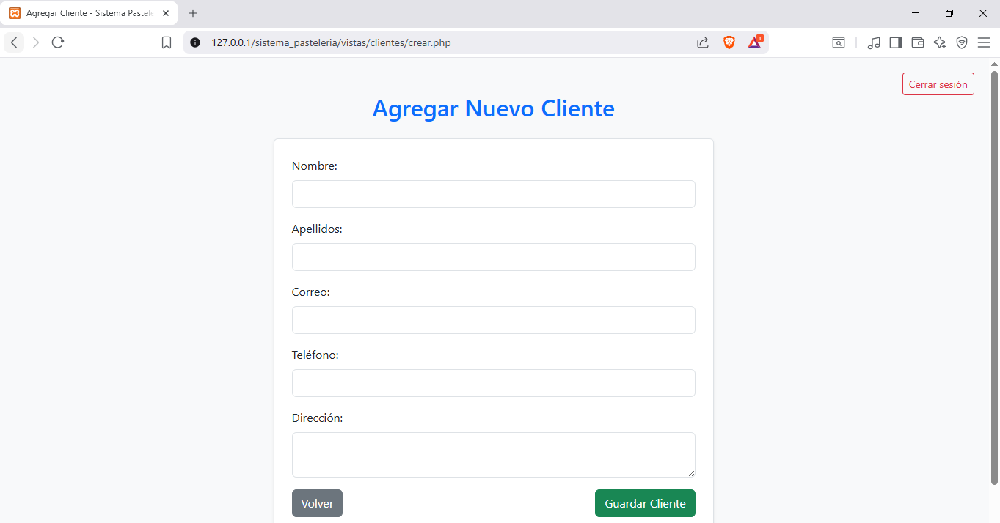
   - Formulario para editar cliente  
     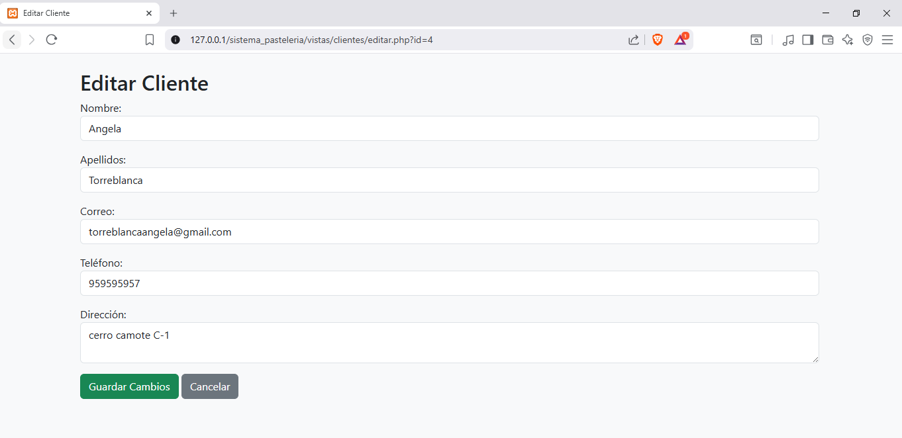
   - Confirmación para eliminar cliente  
     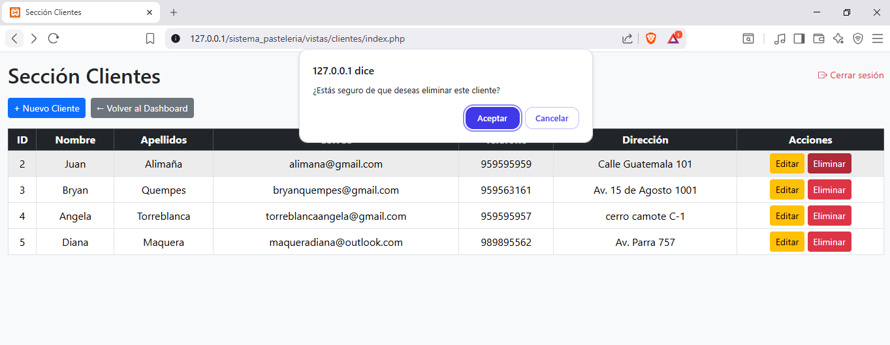

4. **Gestión de Productos**
   - Lista de productos  
     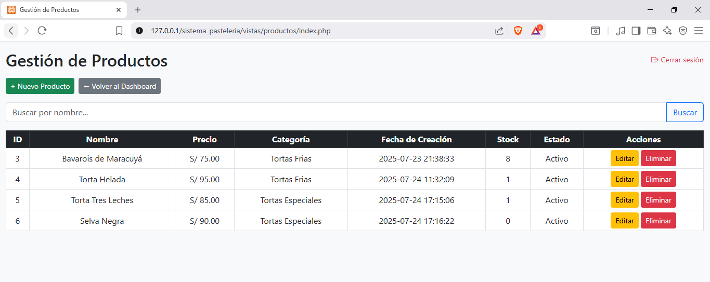
   - Formulario para agregar producto  
     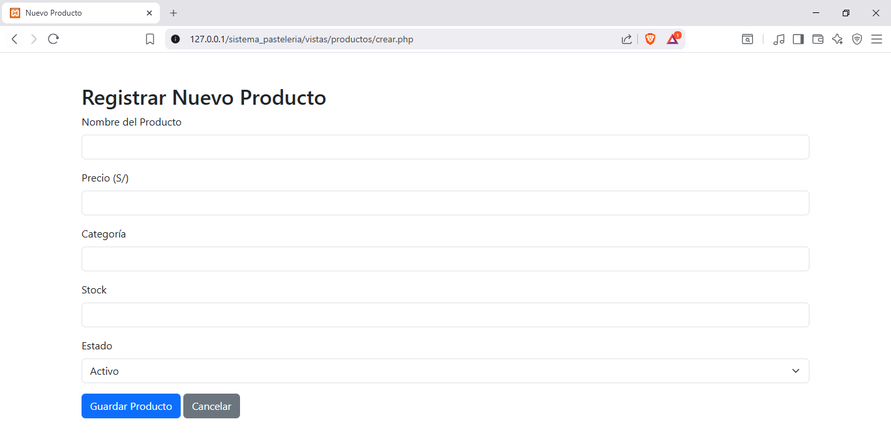
   - Formulario para editar producto  
     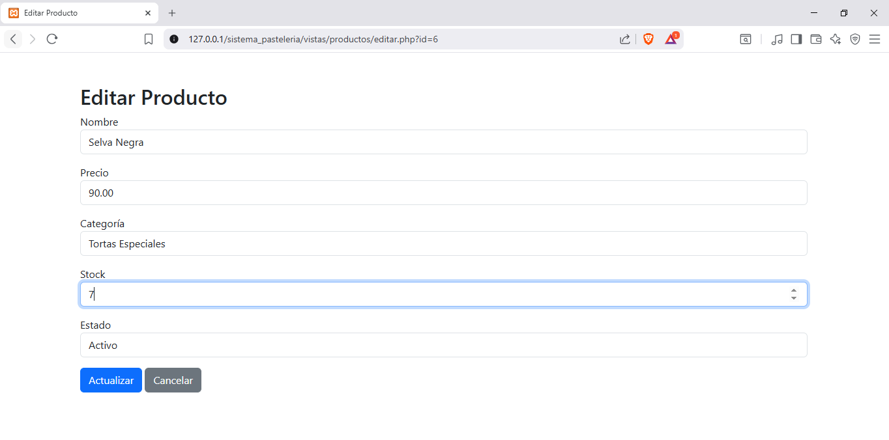
   - Confirmación para eliminar producto  
     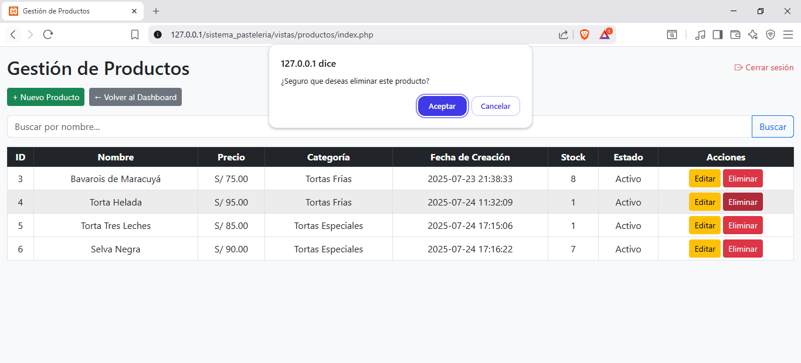

5. **Gestión de Ventas**
   - Registro de una nueva venta  
     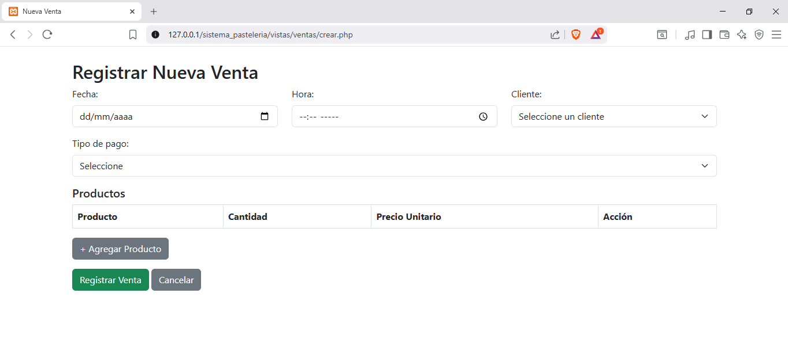
   - Lista de ventas  
     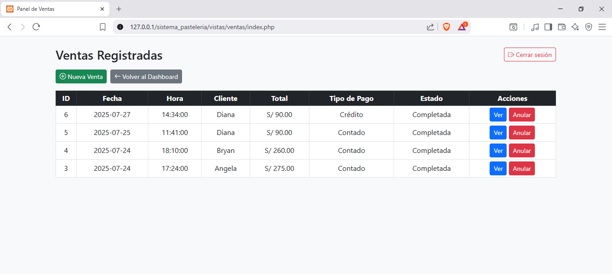
   - Detalle de venta por cliente  
     
   - Detalle de venta por producto  
     
   - Ranking de ventas  
     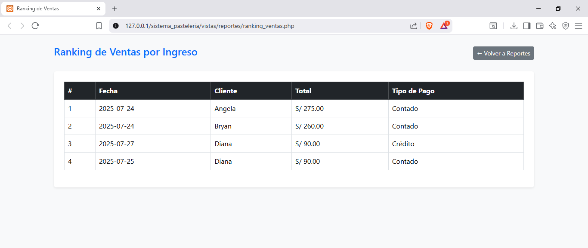

6. **Gestión de Proveedores**
   - Lista de proveedores  
     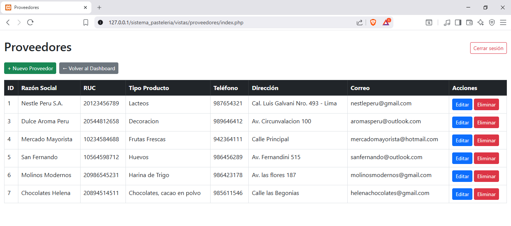
   - Agregar nuevo proveedor  
     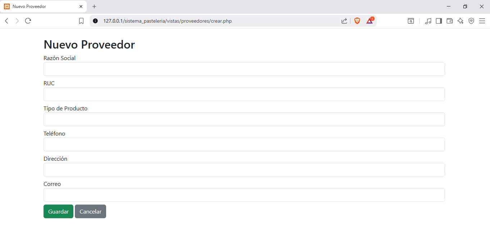
   - Editar proveedor  
     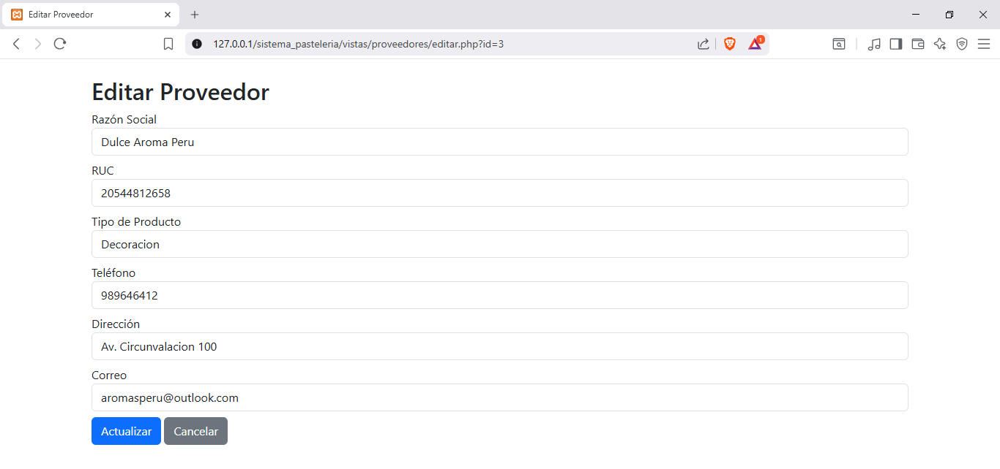
   - Eliminar proveedor  
     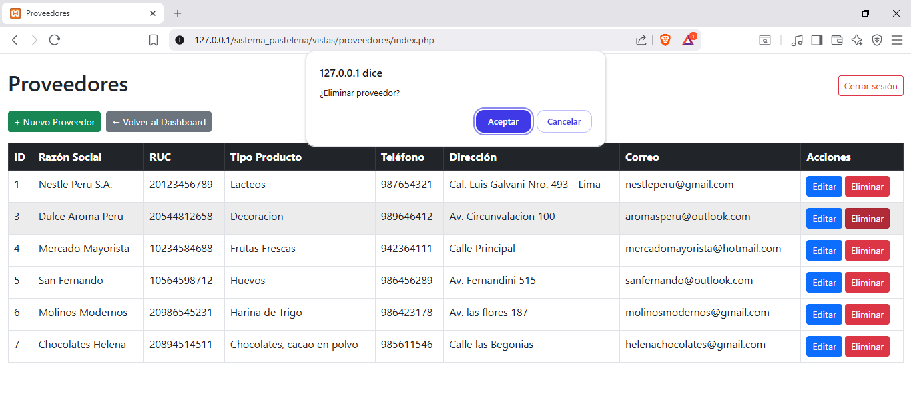

7. **Gestión de Categorías**
   - Lista de categorías  
     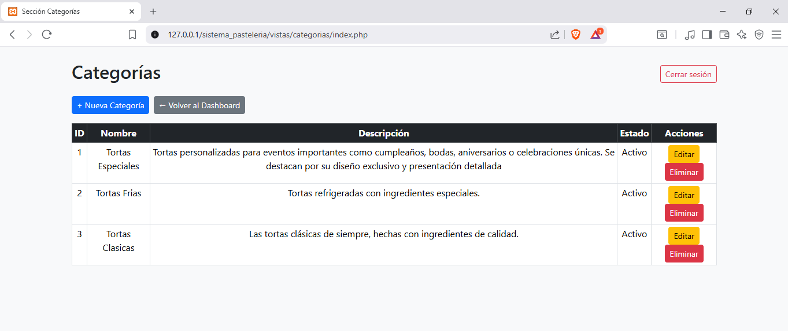
   - Crear categoría  
     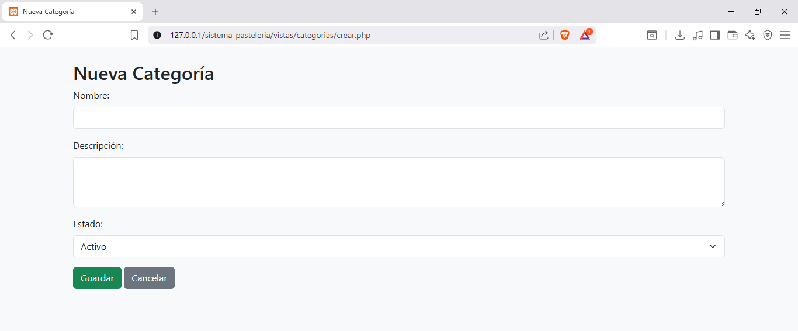
   - Editar categoría  
     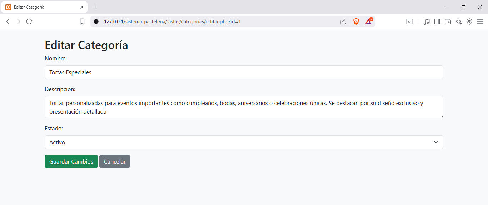
   - Eliminar categoría  
     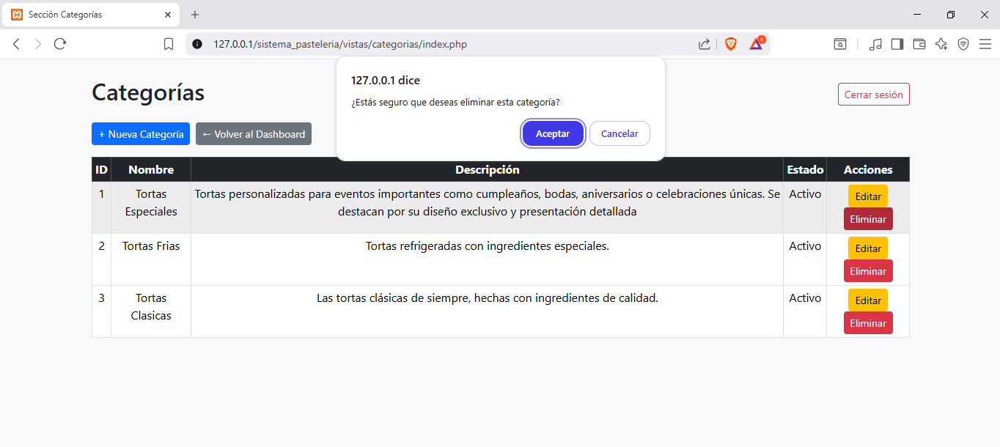


---

## Autores

Este sistema fue desarrollado como parte del curso de Desarrollo de Aplicaciones BackEnd, utilizando herramientas modernas para la web.
Lista de Integrantes:
- Jefe de Proyecto:
 Mestas Gamarra Jennifer Diana
- Programadores:
 Maquera García Diana Fernanda
 Morocco Quispe Sergio Daniel 
- Documentación y Prueba:
 Torreblanca Huamani Jimena Anyela

---
